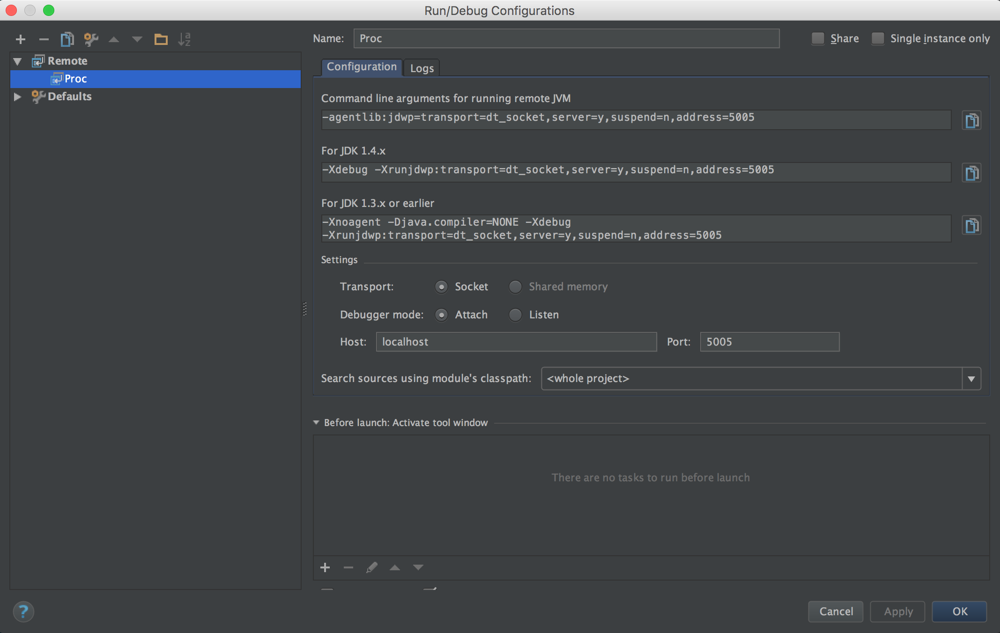

# Experiments with Annotation Processors within `javac`

This project contains a set of experiments to understand what static
information is potentially available to a Java annotation processor when it is
run within Oracle's `javac`. See the subdirectories for information about the
specific experiments.

## Background

**TODO:** A Java annotation processor is a standard form of Java compiler
plugin.

**TODO:** The AST provided to an annotation processor within `javac` is based
on the `JCTree` API.

**TODO:** Everything!

## Debugging The Annotation Processors

To aid in learning about what information might be available to an annotation
processor running in `javac`, this project assists in setting up a development
environment which can use a Java IDE (e.g. Eclipse or IntelliJ IDEA) to debug
an annotation processor when it is run over a project.

We want to be able to use the IDE GUI to set breakpoints in the annotation
processor and to step-through its code. This this will be done by debugging the
[Gradle Daemon](https://docs.gradle.org/current/userguide/gradle_daemon.html)
process which is used to build the project. (This idea came from [this
StackOverflow answer](http://stackoverflow.com/a/36765029) by Gagandeep Singh.)

The `gradle.properties` file has has been configured so that we should be able
to attach an IDE debugger to a Gradle Daemon process. This way, when the user
builds the project, the debugger can be used to step through an annotation
processor, when the annotation processor code is called during compilation of
some other subproject.

For example, the `types/proc` subproject defines an annotation processor which
is a dependency of the `types/driver` subproject. Because of this, whenever
`types/driver` is built, this annotation processor is triggered. Because this
annotation processor code is run within the Gradle Daemon process, we can use
our IDE to set breakpoints in `types/proc` and step through its code while it 
processes source files defined in `types/driver`.

The preferred way to build and debug the project is the provided
[Gradle Wrapper](https://docs.gradle.org/current/userguide/gradle_wrapper.html),
and the below instructions are given with respect to the Gradle Wrapper.
However, it should probably be fine to use your own installation's version of
Gradle if you would prefer.

## Setup a Debugging Environment in IntelliJ IDEA

(1) Clone the Git repository.

(2) Import the project into IntelliJ IDEA as a Gradle project.

(3) Enter the "Run" > "Edit Configurations..." dialog.

(4) Add a new "Remote" configuration, give it a name, and make sure that it
    will connect to `localhost:5005`. 

(5) Using the command line, in the root of the project, make sure that the
    Gradle Daemon is running using `./gradlew --daemon`.

(6) Back in IntelliJ IDEA, start the debug configuration which you just
    created. The debug console should print a message saying: `Connected to the
    target VM, address: 'localhost:5005', transport: 'socket'`

(7) Set a breakpoint in the annotation processing code as desired.

(8) On the command line, in the root of the project, build the whole project
    with `./gradlew clean build`. The Gradle daemon process should pause when
    the build's execution reaches the desired annotation processor, and we can
    now step through the processors code as one would expect.
